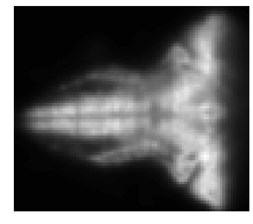
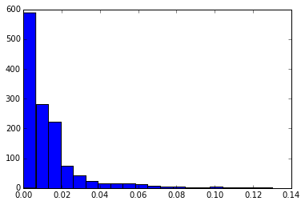

<div>
<h1>Run the cell below to generate the road map (do not modify it)</h1></div>


```python
%%javascript
var kernel = IPython.notebook.kernel;var thename = window.document.getElementById("notebook_name").innerHTML;var command = "THE_NOTEBOOK = " + "'"+thename+"'";kernel.execute(command);command="os.environ['THE_NOTEBOOK'] = THE_NOTEBOOK";kernel.execute(command);var cell = IPython.notebook.get_cell(2);cell.execute();IPython.notebook.get_cell(3).focus_cell();var x = $('.code_cell');$(x[1]).children('.input').hide();
```


    <IPython.core.display.Javascript object>


```python
outputdir = "/tmp/tools/"
!mkdir -p $outputdir
!wget "https://www.dropbox.com/s/4g0pigmro4vo1b4/menutemplate?dl=0" -O /tmp/tools/menutemplate >> /tmp/toollog 2>&1 
!wget "https://www.dropbox.com/s/3flttpzhsja8td7/construct_menu.py?dl=0" -O /tmp/tools/construct_menu.py >> /tmp/toollog 2>&1 
!python /tmp/tools/construct_menu.py "{THE_NOTEBOOK}.ipynb" {outputdir}
from IPython.core.display import HTML
output_file_name = outputdir + THE_NOTEBOOK.replace(" ", "").replace("[", "").replace("]", "") + ".ipynb.html"
with open(output_file_name) as fp:
    html = fp.read()
HTML(html)
```


   <script src="http://code.jquery.com/jquery-latest.min.js" type="text/javascript"></script>
   <script>
      (function($){
         $(document).ready(function(){

         $('#cssmenu li.active').addClass('open').children('ul').show();
            $('#cssmenu li.has-sub>a').on('click', function(){
               $(this).removeAttr('href');
               var margin_left = parseInt($(this).css('padding-left').replace('px', ''));
               var element = $(this).parent('li');
               if (element.hasClass('open')) {
                  element.removeClass('open');
                  element.find('li').removeClass('open');
                  element.find('ul').slideUp(200);
               }
               else {
                  element.addClass('open');
                  element.children('ul').slideDown(200);
                  element.siblings('li').children('ul').slideUp(200);
                  element.siblings('li').removeClass('open');
                  element.siblings('li').find('li').removeClass('open');
                  element.siblings('li').find('ul').slideUp(200);
                  element.children().find('a').css('padding-left', margin_left + 16 + "px");
               }
            });

            var screen_height = $(window).height(); 
            var headerHeight = $("#header").outerHeight();
            var max_height_menu = screen_height - headerHeight;
            $("#cssmenu").css('max-height', max_height_menu + 'px');
            $("#cssmenu").css('top', headerHeight + 'px');
            $("#menu-activator").css('top', headerHeight + 'px');
            $("#cssmenu").show();
            $("#menu-activator").hide();


            $("#menu-activator").mouseover(function(){
              $("#cssmenu").show();
              $("#menu-activator").hide();
            });


            $("#cssmenu").mouseleave(function(){
              $("#cssmenu").hide();
              $("#menu-activator").show();
            });

            $("div.anchor").parent('div').addClass('bcolor');

         });
      })(jQuery);
   </script>
   <style>
      @import url(http://fonts.googleapis.com/css?family=Raleway:400,200);
      #cssmenu,
      #cssmenu ul,
      #cssmenu ul li,
      #cssmenu ul li a {
        margin: 0;
        padding: 0;
        border: 0;
        list-style: none;
        line-height: 1;
        display: block;
        position: relative;
        -webkit-box-sizing: border-box;
        -moz-box-sizing: border-box;
        box-sizing: border-box;
      }
      #cssmenu {
        width: 220px;
        font-family: Raleway, sans-serif;
        color: #ffffff;
        max-height:600px;
        overflow-y:scroll;
        overflow-x:hidden;
        position:fixed;
        top:130px;
        left:0px;
      }
      #cssmenu ul ul {
        display: none;
      }
      #cssmenu > ul > li.active > ul {
        display: block;
      }
      .align-right {
        float: right;
      }
      #cssmenu > ul > li > a {
        padding: 16px 22px;
        cursor: pointer;
        z-index: 2;
        font-size: 16px;
        text-decoration: none;
        color: #ffffff;
        background: #565656;
        -webkit-transition: color .2s ease;
        -o-transition: color .2s ease;
        transition: color .2s ease;
      }
      #cssmenu > ul > li > a:hover {
        color: #d8f3f0;
      }
      #cssmenu ul > li.has-sub > a:after {
        position: absolute;
        right: 26px;
        top: 19px;
        z-index: 5;
        display: block;
        height: 10px;
        width: 2px;
        background: #ffffff;
        content: "";
        -webkit-transition: all 0.1s ease-out;
        -moz-transition: all 0.1s ease-out;
        -ms-transition: all 0.1s ease-out;
        -o-transition: all 0.1s ease-out;
        transition: all 0.1s ease-out;
      }
      #cssmenu ul > li.has-sub > a:before {
        position: absolute;
        right: 22px;
        top: 23px;
        display: block;
        width: 10px;
        height: 2px;
        background: #ffffff;
        content: "";
        -webkit-transition: all 0.1s ease-out;
        -moz-transition: all 0.1s ease-out;
        -ms-transition: all 0.1s ease-out;
        -o-transition: all 0.1s ease-out;
        transition: all 0.1s ease-out;
      }
      #cssmenu ul > li.has-sub.open > a:after,
      #cssmenu ul > li.has-sub.open > a:before {
        -webkit-transform: rotate(45deg);
        -moz-transform: rotate(45deg);
        -ms-transform: rotate(45deg);
        -o-transform: rotate(45deg);
        transform: rotate(45deg);
      }
      #cssmenu ul ul li a {
        padding: 14px 22px;
        cursor: pointer;
        z-index: 2;
        font-size: 14px;
        text-decoration: none;
        color: #dddddd;
        background: #49505a;
        -webkit-transition: color .2s ease;
        -o-transition: color .2s ease;
        transition: color .2s ease;
      }
      #cssmenu ul ul ul li a {
        /*padding-left: 32px;*/
      }
      #cssmenu ul ul li a:hover {
        color: #ffffff;
      }
      #cssmenu ul ul > li.has-sub > a:after {
        top: 16px;
        right: 26px;
        background: #dddddd;
      }
      #cssmenu ul ul > li.has-sub > a:before {
        top: 20px;
        background: #dddddd;
      }
      #menu-activator {
        position: fixed;
        top: 130px;
        left: 0px;
        width: 60px;
        padding: 16px 20px;
        display: block;
        background-color: #565656;
        font-size: 16px;
        color: white;
      }

      div.bcolor, span.bcolor {
      	border-radius: 15px; 
      	background: rgb(224,239,130);
      	padding:10px;
      }

      div.answer, div.comment, div.note {
        background-color: rgb(255, 235, 218);
        padding: 10px;
        border-radius: 5px;
      }

      div.comment::before, div.answer::before, div.note::before {
          background-color: yellow;
          color: red;
          font-weight: bold;
          margin-right:5px;
          padding:3px;
      }

      div.comment::before {
        content: "Comment:";
      }

      div.answer::before {
        content: "Answer:";
      }

      div.note::before {
        content: "Note:";
      }

      @media print{
      	#cssmenu {
      		display:none;
      	}
      }
   </style>
   <title>Roadmap</title>
</head>
<body>
<div id="menu-activator">O</div>
<div id='cssmenu'>
<ul>
<li class='has-sub'><a href="#">ROADMAP</a>
<ul><li><a href='#Goals'>Goals</a></li><li><a href='#Steps'>Steps</a></li><li><a href='#1.-Background-concepts'>1. Background concepts</a></li><li class='has-sub'><a href='#2.-Let's-play'>2. Let's play</a><ul><li class='has-sub'><a href='#2.1.-Play-with-Image-objects'>2.1. Play with Image objects</a><ul><li><a href='#a.-Loading-image-data'>a. Loading image data</a></li><li class='has-sub'><a href='#b.-Inspecting-image-data'>b. Inspecting image data</a><ul><li><a href='#Question-1'>Question 1</a></li><li><a href='#Question-2'>Question 2</a></li></ul></li><li class='has-sub'><a href='#c.-Selecting-samples-of-image-data'>c. Selecting samples of image data</a><ul><li><a href='#Question-3'>Question 3</a></li></ul></li><li class='has-sub'><a href='#d.-Converting-image-data'>d. Converting image data</a><ul><li><a href='#Question-4'>Question 4</a></li></ul></li></ul></li><li class='has-sub'><a href='#2.2.-Play-with-Serises-objects'>2.2. Play with Serises objects</a><ul><li><a href='#a.-Loading-Series-data'>a. Loading Series data</a></li><li><a href='#b.-Inspecting-Series-data'>b. Inspecting Series data</a></li><li class='has-sub'><a href='#c.-Selecting-Series-data'>c. Selecting Series data</a><ul><li><a href='#Question-5'>Question 5</a></li><li><a href='#Question-6'>Question 6</a></li></ul></li><li><a href='#d.-Preprocessing-Series-data'>d. Preprocessing Series data</a></li><li><a href='#e.-Computing-statistics-about-Series-data'>e. Computing statistics about Series data</a></li><li><a href='#f.-Identifying-correlations'>f. Identifying correlations</a></li></ul></li></ul></li><li class='has-sub'><a href='#3.-Usecase'>3. Usecase</a><ul><li><a href='#3.1.-Context'>3.1. Context</a></li><li><a href='#3.2-Data'>3.2 Data</a></li><li class='has-sub'><a href='#3.3.--Building-model'>3.3.  Building model</a><ul><li><a href='#a.-Importing-required-modules'>a. Importing required modules</a></li><li class='has-sub'><a href='#b.-Loading-&-inspecting-the-data'>b. Loading & inspecting the data</a><ul><li><a href='#Question-7'>Question 7</a></li><li><a href='#Question-8'>Question 8</a></li><li><a href='#Question-9'>Question 9</a></li></ul></li><li class='has-sub'><a href='#c.-Clustering-series'>c. Clustering series</a><ul><li><a href='#Question-10'>Question 10</a></li></ul></li><li class='has-sub'><a href='#d.-Testing-models-&-choosing-the-best-one'>d. Testing models & choosing the best one</a><ul><li><a href='#Question-11'>Question 11</a></li><li><a href='#Question-12'>Question 12</a></li><li><a href='#Question-13'>Question 13</a></li><li><a href='#Question-14'>Question 14</a></li></ul></li><li class='has-sub'><a href='#e.-Visualizing-the-result'>e. Visualizing the result</a><ul><li><a href='#Question-15'>Question 15</a></li></ul></li><li class='has-sub'><a href='#f.-Improving-the-result-by-removing-noise'>f. Improving the result by removing noise</a><ul><li><a href='#Question-16'>Question 16</a></li><li><a href='#Question-17'>Question 17</a></li><li><a href='#Question-18'>Question 18</a></li><li><a href='#Question-19'>Question 19</a></li></ul></li><li class='has-sub'><a href='#g.-Improve-the-visualization-by-adding-similarity'>g. Improve the visualization by adding similarity</a><ul><li><a href='#Question-20'>Question 20</a></li><li><a href='#Question-21'>Question 21</a></li></ul></li></ul></li></ul></li><li><a href='#4.-Summary'>4. Summary</a></li><li><a href='#References'>References</a></li></ul>
</li>
<li class='has-sub'><a href="#">QUESTIONS</a>
<ul><li><a href='#Question-1'>Question 1</a></li><li><a href='#Question-2'>Question 2</a></li><li><a href='#Question-3'>Question 3</a></li><li><a href='#Question-4'>Question 4</a></li><li><a href='#Question-5'>Question 5</a></li><li><a href='#Question-6'>Question 6</a></li><li><a href='#Question-7'>Question 7</a></li><li><a href='#Question-8'>Question 8</a></li><li><a href='#Question-9'>Question 9</a></li><li><a href='#Question-10'>Question 10</a></li><li><a href='#Question-11'>Question 11</a></li><li><a href='#Question-12'>Question 12</a></li><li><a href='#Question-13'>Question 13</a></li><li><a href='#Question-14'>Question 14</a></li><li><a href='#Question-15'>Question 15</a></li><li><a href='#Question-16'>Question 16</a></li><li><a href='#Question-17'>Question 17</a></li><li><a href='#Question-18'>Question 18</a></li><li><a href='#Question-19'>Question 19</a></li><li><a href='#Question-20'>Question 20</a></li><li><a href='#Question-21'>Question 21</a></li></ul>
</li>
</ul>
</div>


Advances in imaging equipment and automation have led to an overabundance of data on the functioning of the brain. Technologies today can sample brain activity from a large number of neurons in a large region while organisms are actively behaving. For example, by simultaneously recording the electrical activity of every neuron of the mouse brain over an extended period of time, the amount of data generated will create completely new paradigms for biology, that will require the development of tools to extract value from such unprecedented amount of information.

In this Notebook, we use PySpark and the [Thunder project](https://github.com/thunder-project/thunder), which is developed on top of PySpark, for processing large amounts of time series data in general, and neuroimaging data in particular. We will use these tools for the task of understanding some of the structure of Zebrafish brains, which is a typical (and simple) example used in Neuroimaging. Using Thunder, we will cluster different regions of the brain (representing groups of neurons) to discover patterns of activity as the zebrafish behaves over time.

**Note**: Please, use the documentation for the [Thunder API](http://docs.thunder-project.org/) to learn the details of function calls!


# Goals

The main goals of this notebook are:

1. Learn about Thunder and how to use it
2. Revisit the K-Means algorithm and the method for choosing K
3. Learn alternative approaches to improve the results


# Steps
1. In section 1, we go though some background concepts that are used in this notebook.
2. Next, in section 2, we will get familiar with Thunder, its methods and its data types, by working on some simple tasks.
3. Finally, in section 3, we will build a model to cluster the neurons of a zebrafish based on their behavior. In this step, we will learn about how to use K-Means when the value of K is unknown. Finally, some tricks to improve the results are introduced.

# 1. Background concepts

In this section, we cover the terminology and the concepts that constitute the domain knowledge for this notebook.

As it should be well-known, a `pixel` is a combination of "**pic**ture **el**ement": digital images can be modeled as simple 2-dimensional (2D) matrices of intensity values, and each element in the matrix is a pixel. In color images, a pixel contains values of red, green, and blue channels. In a grayscale image, the three channels have the same value, such that each pixel is reduced to be a single value.

A single 2D image is not nearly enough to express 3D objects, which use a **voxel**, representing a value of the 3D image on a regular grid in a three-dimensional space.  A possible technique to work on 3D images is to acquire multiple 2D images of different slices (or `planes`, or `layers`) of a 3D object, and stack them one on top of each other (a z-stack). This ultimately produces a 3D matrix of intensity values, where each value represents a `volume element` or `voxel`.


<div style="text-align:center;">This z-stack image has 4 layers. A point is a voxel. It can be determined by the layer's index and the position in that layer.</div>

In the context of the Thunder package, we use term `image` for `3D-image` or `stack image`. Thunder uses `Image` type to  represent 3D-image. Each `Image` object is a collection of either 2D images or 3D volumes. In practice, it wraps an n-dimensional array, and supports either distributed operations via Spark or local operations via  numpy , with an identical API.

Stack-images can represent 3D objects, but it can be difficult to take the temporal relationship of the images into account. To do that, we need another data structure that shows the changes of voxels over time. In the Thunder package, the internal `Series` type can be used exactly for this purpose. Each `Series` is a 1D array such that each element is a value of the voxel at a timestamp.

The most common series data is time series data, in which case the index is time and each record is a different signal, like a channel or pixel.

We now have sufficient material to start playing with Thunder !!!

# 2. Let's play

Well, wait a second before we play... Remember, we're going to use Spark to perform some of the computations related to this Notebook. Now, when you spin a Zoe Notebook application (this comment is valid for students at Eurecom), you'll gain access to an individual, small Spark cluster that is dedicated to your Notebook. This cluster has two worker machines, each with 6 cores. As such, a good idea to obtain smooth performance and a balanced load on the workers, is to ```repartition``` your data (i.e., the RDDs you use to represent images or time series).

In this Notebook we **expect** students to take care of repartitioning, and such care will be compensated by bonus points.

## 2.1. Play with Image objects

### a. Loading image data

Both `images` and `series` can be loaded from a variety of data types and locations. You need to specify whether data should be loaded in 'local' mode, which is backed by a numpy array, or in 'spark' mode, which is backed by an RDD by using the optional argument `engine`. The argument `engine` can be either `None` for local use or a SparkContext for` distributed use with Spark.

```python
import thunder as td

# load data from tif images
data = td.images.fromtif('/path/to/tifs')

# load data from numpy-arrays
data = td.series.fromarray(somearray)
data_distributed = ts.series.fromarray(somearray, engine=sc)
```

We can load some example image data by:


```python
import thunder as td
import numpy as np

# load some example image data
image_data = td.images.fromexample('fish', engine=sc)

# print the number of images
print(image_data.count())
```

    20


### b. Inspecting image data


```python
%matplotlib inline
import matplotlib.pyplot as plt

# import two function to draw images easier
from showit import image as draw_image
from showit import tile as draw_tile

print("Shape of the data:", image_data.shape)

first_image = image_data.first() # get the values of Image object
# or first_image = image_data[0] # get the Image object

print("Shape of the data of the first image:", first_image.shape)

print("Data of the first image:", first_image)


# draw the first layer of the first image
draw_image(first_image[0])

# draw all layers of the first image
draw_tile(first_image)

# we can use index slices to take images
samples = image_data[0:6]


```

    Shape of the data: (20, 2, 76, 87)
    Shape of the data of the first image: (2, 76, 87)
    Data of the first image: [[[26 26 26 ..., 26 26 26]
      [26 26 26 ..., 26 26 26]
      [26 26 26 ..., 27 27 26]
      ..., 
      [26 26 26 ..., 27 27 26]
      [26 26 26 ..., 27 26 26]
      [25 25 25 ..., 26 26 26]]
    
     [[25 25 25 ..., 26 26 26]
      [25 25 25 ..., 26 26 26]
      [26 26 26 ..., 26 26 26]
      ..., 
      [26 26 26 ..., 26 26 26]
      [26 26 26 ..., 26 26 26]
      [25 25 25 ..., 26 26 26]]]


From the result above, the shape of the loaded data is (20, 2, 76, 87). It means we have total 20  3D images objects. Each image has 2 layers, each layer has size 76x87. 

Note that, although  data  is not itself an array (it can be a kind of RDD), we can index into it using bracket notation, and pass it as input to plotting methods that expect arrays. In these cases, the data will be automatically converted.

One of the advantages of working in Python is that we can easily visualize our data stored into Spark RDDs using the Matplotlib library. Function `draw_image` and `draw_tile` that take advantages of Matplotlib are examples.


<div class="anchor"></div>

#### Question 1

a) Use the function `imgshow` from matplotlib to plot each layer of the first image in `image_data`.

b) Discuss the choice of parameters you use for the method `imgshow`


```python
img = image_data.first() 
# or:
# img = image_data[1]

# show the first layer
plt.imshow(img[0], interpolation='nearest', aspect='equal', cmap='gray')
plt.title("Layer 0 of the first image")
plt.show()

# show the second layer
plt.imshow(img[1], interpolation='gaussian', aspect='equal')
plt.title("Layer 1 of the first image")
plt.show()

```


<div class="note">
We decide to use the colored version of the plot because it underlines the differences between the area with high energy consumption from less active areas.
<br> <br>
We also decided to use the gaussian interpolation because it avoid to have pixelated images.
</div>

Then, we can perform operations that aggregate information across images.


<div class="anchor"></div>

#### Question 2
Calculate the standard deviation across all images you have in `image_data` (that is, our dataset). To clarify, let's focus on an individual layer (say the first layer of each image). For every `voxel`, compute the standard deviation of its values across different images for the same layer. Visualize the standard deviation you obtain, for example concerning a single layer (as before, say the first layer).

HINT 1: to avoid wasting time and energy, make sure you lookup for methods that could help answer the question from the Thunder documentation.

HINT 2: We can also use function `draw_image(<data>)` to plot an image in a simple way instead of using many statements with matplotlib as before.

**NOTE:** Comment the image you obtain. What does it mean to display the standard deviation across all images in a single layer?


```python
# calculate standard deviation of images
std_imgs = image_data.std()

# show the first layer standard deviation
plt.figure(figsize=(13,8))
plt.subplot(2, 2, 1)
plt.imshow(std_imgs.first()[0], interpolation='gaussian', aspect='equal')
plt.title("Layer 0 standard deviation")
plt.subplot(2, 2, 2)
plt.imshow(image_data.first()[0], interpolation='gaussian', aspect='equal')
plt.title("Layer 0 of the first image")

# show the second layer standard deviation
plt.subplot(2, 2, 3)
plt.imshow(std_imgs.first()[1], interpolation='gaussian', aspect='equal')
plt.title("Layer 1 standard deviation")
plt.subplot(2, 2, 4)
plt.imshow(image_data.first()[1], interpolation='gaussian', aspect='equal')
plt.title("Layer 1 of the first image")


plt.show()
```


<div class="note">

The hot areas of the standard deviation image represents where the brain activity changes most. Instead, in the normal images the red area represets the most active areas, so the areas with a low standard deviation but high activity are the most used over time, on the other hand the one that are red in both images are intermittently used.

</div>

### c. Selecting samples of image data

The Images API offers useful methods for working with large image data. For example, in some cases it is necessary to subsample each image, to make sure we can analyze it efficiently.


<div class="anchor"></div>

#### Question 3
The source code below subsamples image data with different ratios on different dimensions. 

a) Complete the source code to plot the first layer of the first image. 

b) What is the shape of `image_data` before and after subsampling?


```python
subsampled = image_data.subsample((1, 5, 5))
# Stride to use in subsampling. If a single int is passed, each dimension of the image
# will be downsampled by this same factor. If a tuple is passed, it must have the same
# dimensionality of the image. The strides given in a passed tuple will be applied to
# each image dimension
plt.imshow(subsampled.first()[0], interpolation='nearest', aspect='equal') 
plt.title("Subsampling image")
plt.show()
print("Before subsampling:", image_data.shape)
print("After subsampling:", subsampled.shape)

```


    Before subsampling: (20, 2, 76, 87)
    After subsampling: (20, 2, 16, 18)


Note that `subsample` is an RDD operation, so it returns immediately. Indeed, we know that in Spark you must apply a RDD action to trigger the actual computation.

### d. Converting image data
We can also convert an RDD of images to a RDD of series by:


```python
seriesRDD = image_data.toseries()
seriesRDD.cache()
```


    Series
    mode: spark
    dtype: uint8
    shape: (2, 76, 87, 20)


<div class="anchor"></div>

#### Question 4
According to your understanding about `Series` objects which was introduced in section 1, what is the shape of `seriesRDD` and its elments ?

Comment your results, don't just display numbers.


```python
print(seriesRDD.shape)
```

    (2, 76, 87, 20)


<div class="answer">

The seriesRDD variable contains 2 layer of 76x87 vortex that changing over the time and we have 20 sample of this time changing. 

</div>

For a large data set that will be analyzed repeatedly as a `Series`, it will ultimately be faster and more convienient to save `Images` data to a collection of flat binary files on a distributed file system, which can in turn be read back in directly as a `Series`, rather than repeatedly converting the images to a `Series` object. This can be performed either through a ThunderContext method, `convertImagesToSeries`, or directly on an Images object, as done below:


```python
# image_data.toseries().tobinary('directory', overwrite=True)
#ts = td.series.frombinary('directory', engine=sc)
```

We will study about `Series` object in the next section.

## 2.2. Play with Serises objects

### a. Loading Series data

In this section, we use a sample data to explore `Series` objects.


```python
# series_data = td.series.fromexample('fish', engine=sc)
# series_data = td.series.frombinary(path='s3n://thunder-sample-data/series/fish', engine=sc)
series_data = image_data.toseries()
```

### b. Inspecting Series data

`Series_data` is a distributed collection of key-value records, each containing a coordinate identifier and the time series of a single `voxel`. We can look at the first record by using `first()`. It’s a key-value pair, where the key is a tuple of `int` (representing a spatial coordinate within the imaging volume) and the value is an one-dimensional array.


```python
first_series = series_data.first() # get the values of Series object
#first_series = series_data[0] # get a Series object

print("Shape of series:", series_data.shape)
print("The first series:", first_series)
print("Each element in series has", len(first_series), "values")

# print the 10th value of voxel (0,0,0)
# layer = 0
# coordinator = (0,0) in that layer
print("value 10th of voxel (0,0,0):", np.array(series_data[0,0,0,10]))
```

    Shape of series: (2, 76, 87, 20)
    The first series: [26 26 26 26 26 26 26 25 26 25 25 25 26 26 26 26 26 26 26 26]
    Each element in series has 20 values
    value 10th of voxel (0,0,0): 25


The loaded series data is a multi-dimensional array. We can access the values of a voxel in time series by using a tuple as above. In our data, each voxel has 20 values corresponding to 20 states at 20 different times.

### c. Selecting Series data
Series objects have a 1D index, which can be used to subselect values.


```python
print("shape of index:", series_data.index.shape)
print("the first element of a subset", series_data.between(0,8).first())
```

    shape of index: (20,)
    the first element of a subset [26 26 26 26 26 26 26 25]


Values can be selected based on their index:


```python
print(series_data.select(lambda x: x > 3 and x < 8).index)
print(series_data.select(lambda x: x > 3 and x < 8).first())
```

    [4, 5, 6, 7]
    [26 26 26 25]


<div class="anchor"></div>

#### Question 5
Plot the first 20 values of **all** series objects (that is the values of a voxel) in the series data. This means, on the same plot, you should visualize the values each voxel takes in the first 20 time intervals.


```python
import numpy as np

# only select the first 20 states of each object
samples = series_data.between(0,20).tordd().values().collect()

plt.plot(np.array(samples).T)
plt.show()

```


Now, another objective we can have is to select specific series objects within the same series data. For example, we can select objects randomly by using function `sample`.


<div class="anchor"></div>

#### Question 6
Let's plot a random subset of the data using the method `sample`. 

Complete the source code below to plot the first 20 values of 30 objects that are selected randomly among those that pass the condition on the standard deviation, using function `sample`.


```python
# select 30 objects randomly which have standard deviation > threshold
# Extract random subset of records, filtering on a summary statistic.
examples = series_data.filter(lambda x: x.std() > 1.0).sample(30)
# only plot first 20 states of each object
plt.plot(np.array(examples).T)
plt.show()
```


### d. Preprocessing Series data
A `Series` objects has some methods which can be useful in an eventual preprocessing phase.

For example,`center` subtracts the mean, `normalize` subtracts and divides by a baseline (either the mean, or a percentile).


```python
examples = series_data.center().filter(lambda x: x.std() >= 10).sample(50)
plt.plot(np.array(examples).T)
plt.show()
```


```python
normalizedRDD = series_data.normalize(method='mean').filter(lambda x: x.std() >= 0.1).sample(50)
plt.plot(np.array(normalizedRDD).T)
plt.show()
```


### e. Computing statistics about Series data
A `Series` can be summarized with statistics both within and across images. To summarize **across records** (the statistic of all voxels at each timestamp), we can do the following:


```python
# Default normalization in on percentile
plt.plot(series_data.normalize().max());
plt.plot(series_data.normalize().mean());
plt.plot(series_data.normalize().min());
```


To summarize **within records**, we can use the `map` method:


```python
means = series_data.map(lambda x: x.mean())
flat_means = means.flatten().toarray()
flat_stdevs = stdevs = series_data.map(lambda x: x.std()).flatten().toarray()
print("means:", flat_means)
print("length of means:", len(flat_means))
print("mean of the first series:", flat_means[0])
print("standard deviation of the first series:", flat_stdevs[0])
```

    means: [ 25.8   25.85  25.7  ...,  26.    26.    26.  ]
    length of means: 13224
    mean of the first series: 25.8
    standard deviation of the first series: 0.4


`means` is now a `Series` object, where the value of each record is the mean across the time series for that voxel.

Note that in the source code above, we use function `toarray` to return all records to the driver as a numpy array.

For this `Series`, since the keys correspond to spatial coordinates, we can `pack` the results back into a local array in **driver node**.


To look at this array as an image, we can use function `draw_image` as before.


```python
# we should recover the shape of means before plotting
# draw the stdandard deviations of series that belong to the first layer
img = draw_image(flat_means.reshape((2, 76, 87)) [0,:,:])
```





Note that `toarray` is an example of a local operation, meaning that all the data involved will be sent to the Spark driver node. In this case, packing the mean is no problem because its size is quite small. But for larger data sets, this can be **very problematic**. So, it's a good idea to downsample, subselect, or otherwise reduce the size of your data before attempting to pack large image data sets! 

### f. Identifying correlations

In several problem domains, it may also be beneficial to assess the similarity between a designated signal (time series) and another signal of interest by measuring their correlation. For example, say we have two time series corresponding to the consumption of Coca Cola and Pepsi, it would perhaps be interesting to verify whether behavioural patterns are similar for both brands over time.<br>

Simply as a proof of concept, we shall compare our data to a random signal and we expect that, for a random signal, the correlation should be low. The signal can be stored as a numpy array or a MAT file containing the signal as a variable. Note that the size of the signal must be equal to the size of each `Series` element.


```python
from numpy import random
signal = random.randn(len(first_series))
print("The correlation of the first element with random signal:" , series_data.correlate(signal).first())

first_element = series_data.first()
corr = series_data.correlate(np.array(first_element)).first()
print("The correlation of the first element with itselft:", corr)
```

    The correlation of the first element with random signal: [ 0.30986166]
    The correlation of the first element with itselft: [ 1.]


# 3. Usecase

## 3.1. Context
Neurons have a variety of biochemical and anatomical properties. Classification methods are thus needed for clarification of the functions of neural circuits as well as for regenerative medicine. In this usecase, we want to categorize the neurons in a fish brain, based on their behavior. The behavior of a neuron can be expressed by the change of its states. The activies of the brains are captured over time into images.

Neurons have a variety of biochemical and anatomical properties. Classification methods are thus needed for clarification of the functions of neural circuits as well as for regenerative medicine. In this usecase, we want to categorize the neurons in a fish brain, based on their behavior. The behavior of a neuron can be expressed by the change of its states. The activies of the brains are captured over time into images.

In this notebook,  we use K-Means, a well known clustering algorithm which is also familiar to you, as it was introduced during the last lecture on anomaly detection.

## 3.2 Data
The dataset we will use is the time series data which we played with in the previous section. Refer to section 2 if you want to duplicate the code to load such data.

## 3.3.  Building model
### a. Importing required modules


```python
import thunder as td
import numpy as np

%matplotlib inline
import matplotlib.pyplot as plt
from pyspark.mllib.clustering import KMeans, KMeansModel
from matplotlib.colors import ListedColormap
from showit import image as draw_image
from showit import tile as draw_tile
```

### b. Loading & inspecting the data


<div class="anchor"></div>

#### Question 7
Load example series data from `fish`, then normalize and cache it to speed up repeated queries. Print the dimensional information of the loaded data.


```python
# we must normalize it to get best clustering
data = td.images.fromexample('fish', engine=sc).toseries().normalize()

# cache it to speed up related queries
data.cache()

# check the dimensions of data
print (data.shape)

```

    (2, 76, 87, 20)


<div class="anchor"></div>

#### Question 8
When studying the properties of large data set, we often take a small fraction of it. We have many strategies to select this subset, such as selecting randomly, selecting elements that has the standard deviation bigger than a threshold, or mixing the conditions.
In this notebook, we will use the second method as a small demonstration.

In order to choose a good value for the threshold of standard deviation, we should compute the stddev of each series and plot a histogram of a 10% sample of the values.

Complete the source code below to compute the standard deviation of series in data. Plot the histogram of it and discuss it in details. In your opinion, what should be the best value for the threshold ?


```python
data_count = data.count()
```


```python
# calculate the standard deviation of each series
# then select randomly 10% of value to plot the histogram
stddevs = data.map(lambda x: x.std()).sample(int(0.1*data_count))

# plot the histogram of 20 bins
plt.hist(stddevs.toarray(), 20)
plt.show()

print("Percentge of data over the threshold:",data.filter(lambda x: x.std() >= 0.09).count() / data_count *100)
```





    Percentge of data over the threshold: 1.0813672111312764


<div class="answer">

From the histogram we can see that most of the points are with a low standard deviation. Part of this points
belongs to the image background, the others have a constant activity. Here we have chosen an high threshold
to visualize the activity of few and most active neurons.

</div>


<div class="anchor"></div>

#### Question 9
Extract some samples just to look at the typical structure of the time series data.
The objects are selected randomly, and has the standard deviation bigger than the threshold which you picked in question 8.
Plot the samples and discuss your obtained figure.


```python
# sample 50 objects of the data randomly base on the standard deviation
examples = data.filter(lambda x: x.std() >= 0.09).sample(50)

# plot the sample data
plt.plot(np.array(examples).T)
plt.show()

```


<div class="answer">

This picture represents the activity of the most active neurons. We can see that most of them have 
the same trend and it can might be described in couple of clusters. 
This curves looks similar to a sinusoid. Indeed the neuronal activity is described by a set of waves.
Of course we cannot base our study only to these neurons but we have to classify all the neurons trying to
have a good clusterisation between neurons with different activity.

</div>

### c. Clustering series
In this section, we will use K-means to cluster the series. In other words, we cluster the voxels based on the their behavior. Currently, we have no clue about how many groups `K` of neural behavior. To this end, instead of choosing a single value K, we use multiple values, build model with each `K` and compare the resulting error values. After that, we can choose the best value of `K`. 


<div class="anchor"></div>

#### Question 10

Complete the source below to build multiple models coresponding to multiple values of `K` using algorithm KMeans of Thunder.

a) Comment the structure of the code. Precisely, focus on the `for` loop, and state what is parallel and what is not.

b) Can you modify the structure of the code such that you use the most of the parallelization capabilities of Spark?


```python
# convert series data to rdd of values
training_data = data.tordd().map(lambda x: np.array(x[1]) ).cache()
```


```python
# declare the possible values of K
ks = [5, 10, 15, 20, 30, 50, 100, 200]

def buildModels(data):
    # declare the collection of models
    models = [] 

    # build model for each K and append to models
    for k in ks:    
        models.append(KMeans.train(data, k)) 
    return models

```


```python
models = buildModels(training_data)
```

<div class="answer">


a) The parallelisation of this code is only in the Kmeans algorithm that is part of Mllib of spark
so it takes all the advantages of the cluster parallel computation.
What is not parallel are the different iterations of this loop indeed those are executed in series.

</div>
<br>
<div class="answer">
b) In this particular case since data is small we could collect in and create a broadcast variable, 
and then apply a map function to each element of ks applying the kmeans function.
We need to collect the 'data' because we can't use an rdd inside the map function of another rdd,
in this way we would obtain a parallelisation of the loop. Now, in order to use Kmeans we need to 
create an rdd from the collected data and pass it to Kmeans function so also this one would be executed
in parallel as before.
We didn't modify the code because our resources are limited and we would not take a relevant advantage out
of this enhancement.
<br><br>


    Maximum parallelization example:
</div>

```python
def buildModelsParallel(data):
    bData = sc.broadcast(data.collect())
    
    def train_model(k):
        bData_rdd = sc.parallelize(bData.value)
        return KMeans.train(bData_rdd, k)
    
    ks_rdd = sc.parallelize(ks)
    models = ks_rdd.map(train_model)

```

### d. Testing models & choosing the best one

Next, we evaluate the quality of each model. We use two different error metrics on each of the clusterings. 

* The first is the sum across all time series of the Euclidean distance from the time series to their cluster centroids. 

* The second is a built-in metric of the `KMeansModel` object.


<div class="anchor"></div>

#### Question 11
a) Write function `model_error_1` to calculate the sum of Squared Euclidean Distance from the Series objects to their clusters centroids.

b) Comment the choice of the error function we use here. Is it a good error definition?


```python
from scipy.spatial.distance import cdist

# calculate the Euclidean distance
# from each time series to its cluster center
# and sum all distances
def model_error_1(data, model):
    errors = data.map(lambda x: cdist([x], [model.centers[model.predict(x)]], metric='sqeuclidean'))
    return errors.sum()[0][0]

```

<div class="answer">

Euclidean distance is not really representative in our problem because some neurons might have the
same signal but have a different intensity level. So that's might be better to associate it with those
which have a similar wave instead to put it with those that have a similar intensity.

</div>


<div class="anchor"></div>

#### Question 12
a) Write function `model_error_2` to calculate the total of similarity of `Series` objects based on how well they match the cluster they belong to, and then calculate the error by inverse the total similarity.

b) Similarly to the previous question, comment the choice of the similarity function.


```python
# calculate the total of similarity of the model on timeseries objects
# and calculate the error by inverse the total similarity

# Estimate similarity between a data point and the cluster it belongs to.
def similarity(centers, p):
    if np.std(p) == 0:
        return 0
    return np.corrcoef(centers[np.argmin(cdist(centers, np.array([p])))], p)[0, 1]


def model_error_2(data, model):
    return 1.0 / data.map(lambda p: similarity(model.centers, p)).reduce(lambda a,b: a+b)

```

<div class="answer">

Despite of the Euclidean distance this other method seems more representative of the error. Because
since we want to see how the signal of different neurons are related the correlation coefficient 
gives us a good metric to estimate how good is our model.

</div>


<div class="anchor"></div>

#### Question 13
Plot the error of the models along with the different values of K in term of different error metrics above. From the figure, in your opinion, what is the best value for `K` ? Why ?


```python
def testAndPlotTheResult(data, models):
    # compute the error metrics for the different resulting clusterings
    
    # errors of models when using function Sum Square Distance Error
    errors_1 = np.asarray([model_error_1(data, model) for model in models])
    
    # error of models when using similarity
    errors_2 = np.asarray([model_error_2(data, model) for model in models])

    # plot the errors with each value of K
    plt.figure(figsize=(8, 6))
    plt.plot(
        ks, errors_1 / errors_1.sum(), 'k-o',
        ks, errors_2 / errors_2.sum(), 'b:v')
    plt.show()

```


```python
testAndPlotTheResult(training_data, models)
```


<div class="answer">

The Euclidean distance is a rappresentation of the distances between the usage of that point and its centroids.
The Similarity error instead gives us an indicator of how similar is the trend between points and centroids.
Now since we are trying to understand which part of the brain are used in different time snap and which one is correlated to another in our opinion the similarity index is more rappresentative.
Loking at the plot we can se that it is stable after k=30.

</div>

Determining the optimal $k$ is particularly troublesome for the $k$-Means algorithm because error measures based on distance decrease monotonically as $k$ increases. This arises because when $k$ is increased, each cluster is decomposed into more and more clusters, such that each point becomes closer to its cluster mean. In fact, in the extreme case where $k=N$, each point will be assigned to its own cluster, and all distances are reduced to nil. Cross-validation or using holdout data is also unlikely to be particularly effective in this case.<br>

To this end, it is often worth assessing a model by measuring its impact on the overall aim of carrying out the clustering. For example, if we are carrying out $k$-means for grouping customers having similar taste and purchase history with the ultimate intent of making recommendations to customers, our objective function should measure how effective the recommendations are (perhaps using holdout data). An appealing aspect of using such a metric is that it is no longer guaranteed to behave monotonically with respect to $k$. We shall investigate this further in Question 20.


<div class="anchor"></div>

#### Question 14
Plot the centroids of the best model. Do you think that the result is good ?


```python
# plot the best performing model
bestModel = models[4]
plt.plot(np.asarray(bestModel.centers).T)
plt.show()
```


<div class="answer">

In this plot we can see that the centroids have different shapes and those which have a
similar trend have a different modulus. That is not really good because we want all those curves with the same trend to 
be in the same cluster this could be done reducing the number of cluster but if we do so the error
rapidly increase because some of the noise goes in the wrong cluster we can do that only if we have cleaned data.

</div>

### e. Visualizing the result
We can also plot an image of labels of neurons, such that we can visualize the group of each neuron.


<div class="anchor"></div>

#### Question 15
Complete the source code below to visualize the result of clustering.


```python
# predict the nearest cluster id for each voxel in Series
#labels = bestModel.predict(training_data)
labels1 = models[4].predict(training_data)

# collect data to the driver
imgLabels1 = np.asarray(labels1.collect()).reshape((2, 76, 87))

# consider the voxel of the first layers
#draw_image(imgLabels[0,:,:])

plt.figure(figsize=(16,8))
plt.subplot(1,2,1)
plt.imshow(imgLabels1[0,:,:], interpolation='nearest', aspect='equal')
plt.title("Clustering result wiht k="+str(ks[4]))

# predict the nearest cluster id for each voxel in Series
labels = models[3].predict(training_data)

# collect data to the driver
imgLabels = np.asarray(labels.collect()).reshape((2, 76, 87))

plt.subplot(1,2,2)
plt.imshow(imgLabels[0,:,:], interpolation='nearest', aspect='equal')
plt.title("Clustering result wiht k="+str(ks[3]))
plt.show()

```


With the default color scheme, this figure is quite difficult to understand and to distinguish the groups according to their similar colors. So, we should have a smater color selection. The fact is, when we do clustering, it is often the case that some centers are more similar to one another, and it can be easier to interpret the results if the colors are choosen based on these relative similarities. The method `optimize` tries to find a set of colors such that similaries among colors match similarities among an input array (in this case, the cluster centers). The optimization is non-unique, so you can run multiple times to generate different color schemes.


```python
from numpy import arctan2, sqrt, pi, abs, dstack, clip, transpose, inf, \
    random, zeros, ones, asarray, corrcoef, allclose, maximum, add, multiply, \
    nan_to_num, copy, ndarray, around, ceil, rollaxis

# these functions below are inspired mainly from Thunder-Project source code, v.0.6
# url: https://raw.githubusercontent.com/thunder-project/thunder/branch-0.6/thunder/viz/colorize.py

# Optimal colors based on array data similarity.
def optimize_color(mat):
        mat = np.asarray(mat)

        if mat.ndim < 2:
            raise Exception('Input array must be two-dimensional')

        nclrs = mat.shape[0]

        from scipy.spatial.distance import pdist, squareform
        from scipy.optimize import minimize

        distMat = squareform(pdist(mat, metric='cosine')).flatten()

        optFunc = lambda x: 1 - np.corrcoef(distMat, squareform(pdist(x.reshape(nclrs, 3), 'cosine')).flatten())[0, 1]
        init = random.rand(nclrs*3)
        bounds = [(0, 1) for _ in range(0, nclrs * 3)]
        res = minimize(optFunc, init, bounds=bounds, method='L-BFGS-B')
        newClrs = res.x.reshape(nclrs, 3).tolist()

        from matplotlib.colors import ListedColormap

        newClrs = ListedColormap(newClrs, name='from_list')

        return newClrs

# Blend two images together using the specified operator.
def blend(img, mask, op=add):
        if mask.ndim == 3:
            for i in range(0, 3):
                img[:, :, :, i] = op(img[:, :, :, i], mask)
        else:
            for i in range(0, 3):
                img[:, :, i] = op(img[:, :, i], mask)
        return img

def _prepareMask(mask):
        mask = asarray(mask)
        mask = clip(mask, 0, inf)

        return mask / mask.max()
    
# Colorize numerical image data.
def transform(cmap, img, mask=None, mixing=1.0):
        from matplotlib.cm import get_cmap
        from matplotlib.colors import ListedColormap, LinearSegmentedColormap, hsv_to_rgb, Normalize

        img = asarray(img)
        dims = img.shape

        if cmap not in ['polar', 'angle']:

            if cmap in ['rgb', 'hv', 'hsv', 'indexed']:
                img = copy(img)
                for i, im in enumerate(img):
                    norm = Normalize(vmin=None, vmax=None, clip=True)
                    img[i] = norm(im)

            if isinstance(cmap, ListedColormap) or isinstance(cmap, str):
                norm = Normalize(vmin=None, vmax=None, clip=True)
                img = norm(copy(img))

        if mask is not None:
            mask = _prepareMask(mask)

        if isinstance(cmap, ListedColormap):
            if img.ndim == 3:
                out = cmap(img)
                out = out[:, :, :, 0:3]
            if img.ndim == 2:
                out = cmap(img)
                out = out[:, :, 0:3]
        else:
            raise Exception('Colorization method not understood')

        out = clip(out, 0, 1)

        if mask is not None:
            out = blend(out, mask, multiply)

        return clip(out, 0, 1)


# generate the better color scheme
newClrs = optimize_color(bestModel.centers)
plt.gca().set_color_cycle(newClrs.colors)
plt.plot(np.array(bestModel.centers).T);

# draw image with the new color scheme
brainmap = transform(newClrs, imgLabels[0,:,:])
im = draw_image(brainmap)

```


### f. Improving the result by removing noise
One problem with what we've done so far is that clustering was performed on all time-series without data pre-processing. Many of  time-series objects were purely noise (e.g. those outside the brain), and some of the resulting clusters capture these noise signals. A simple trick is to perform clustering after subselecting pixels based on the standard deviation of their time series. First, let's look at a map of the standard deviation, to find a reasonable threshold that preserves most of the relavant signal, but ignores the noise.


<div class="anchor"></div>

#### Question 16
Try with different threshold of standard deviation to filter the noise. What is the "best value" that preserves most of the relavant signal, but ignores the noise ? Why ?


```python
# calculate the standard deviation of each voxel 
# then collect to the driver
stdMap = data.map(lambda x: x.std()).toarray()

# here we should try with many different values of threshold 
# and choosing the best one
# visualize the map of the standard deviation after filtering

threshold = 0.02
im = draw_image(stdMap[0,:,:] > threshold)

```


<div class="answer">

The value of the threshold has been chosen trying to see how many values survived after the filtering
and trying to make it correspond to the hot area of the standard deviation picture of the second question.

</div>


<div class="anchor"></div>

#### Question 17
Filter your data such that we only keep the voxels that have the standard deviation bigger than the threshold in question 16.


```python
####!@SOLUTION@!####
from numpy import std
# remove series object that has the standard deviation bigger than a threshold
filtered = data.filter(lambda x: x.std() > threshold).cache()
print(filtered.shape)

```

    (2299, 20)


<div class="anchor"></div>

#### Question 18
Re-train and choose the best models with different values of `K` on the new data.


```python
filtered_data = filtered.tordd().map(lambda x: np.array(x[1]) ).cache()
models = buildModels(filtered_data)
testAndPlotTheResult(filtered_data, models)
```


<div class="answer">

After filtering the data the euclidean distance curve is the practically the same but the similarity
curve flatten a lot. This allows us to take a smaller number of k obtaining centroids that represents
a different curve independently to their modulus.

</div>


<div class="anchor"></div>

#### Question 19

a) Plot the centroids of the best model with a smart color selection.

b) Plot the result of the clustering algorithm by a color map of voxels.

c) Comment about your figures.


```python
def draw_filtered_labels(data, labels, threshold=0.02):
    # collect data to the driver
    imgLabels = np.asarray(labels)
    stdMap = data.map(lambda x: x.std()).toarray()
    imageMap = stdMap[:,:,:] > threshold
    print_image = []
    i=0
    for pixel in imageMap.reshape(13224):
        if pixel == True:
            print_image.append(imgLabels[i])
            i+=1
        else:
            print_image.append(-1)

    print_image = np.asarray(print_image).reshape((2, 76, 87))
    # draw image with the new color scheme
    brainmap = transform(newClrs, print_image[0,:,:])
    draw_image(brainmap)
    return print_image
```


```python
bestModel = models[1]

plt.figure(figsize=(16,6))
plt.subplot(1,2,2)
newClrs = optimize_color(models[2].centers)
plt.gca().set_color_cycle(newClrs.colors)
plt.title("Model with k = 20")
plt.plot(np.array(models[2].centers).T);

plt.subplot(1,2,1)
newClrs = optimize_color(bestModel.centers)
plt.gca().set_color_cycle(newClrs.colors)
plt.title("Model with k = 10 (Best model)")
plt.plot(np.array(bestModel.centers).T);
plt.show()

# predict the nearest cluster id for each voxel in Series
KMlabels = bestModel.predict(filtered_data)

print_image = draw_filtered_labels(data, KMlabels.collect(), threshold)
```


<div class="comment">

As mentioned in the previous answer we can reduce the number of clusters.
We have chosen a k=10 as best k value. Indeed as you can see in the two plots now few cluster can describe 
well our data and if we try to increase it we have much more centroids with a very similar shape but
that's what we are trying to avoid.

</div>

### g. Improve the visualization by adding similarity
These maps are slightly odd because pixels that did not survive our threshold still end up colored as something. A useful trick is masking pixels based on how well they match the cluster they belong to. We can compute this using the `similarity` method of `KMeansModel`.


```python
sim = data.map(lambda x: similarity(bestModel.centers, x))

imgSim = sim.toarray()

# draw the mask
im = draw_image(imgSim[0,:,:], cmap='gray', clim=(0,1))
```


And, it can be used as a linear mask on the colorization output


```python
brainmap = transform(newClrs, print_image[0,:,:], mask=imgSim[0,:,:])
im = draw_image(brainmap)
```


<div class="anchor"></div>

#### Question 20
Since in the usecase we build and test the model from the same data, it can lead to overfitting problems. To avoid that, we can divide the data into training set and testing set. Note that each neuron occurs only one time in the data. So, we can not divide the data by dividing the neurons. Instead, we can divide the states of neurons into two different sets. Let's try with this approach and show the result.

<div class="note">

To answer this question we decided not to split the set in the dimension of time because looking at the
plot of the neuron activity we have only one period and if we cut it the model would not have enough
information to create a good clusterization of data.
But since our goal is to find neurons that have similar activity taking out some of them is not a 
bad idea from our point of view.
furthermore we are trying to check if our model encounter overfitting problem so we sampled the 
neurons and then see if neurons used as test set are going to be in the same cluster of the model created using
the previous dataset (the filtered one).

</div>


```python
images = td.images.fromexample('fish', engine=sc)
```


```python
threshold = 0.02

volex_num = images[0].toseries().count()
test_set_size = int(0.1*volex_num)
samples_index = sc.parallelize(13223 * np.random.random_sample(test_set_size))
image_series = images.toseries().normalize()
image_series_filtered = image_series.filter(lambda x: x.std() > threshold).cache()

```


```python
[test_set, training_set] = image_series_filtered.tordd().randomSplit([0.1, 0.9], 42)
training_set = training_set.map(lambda x: np.array(x[1])).cache()
test_set = test_set.map(lambda x: np.array(x[1])).cache()
```


```python
training_models = buildModels(training_set)
testAndPlotTheResult(training_set, training_models)

```


```python
best_training_models = training_models[1]

newClrs = optimize_color(best_training_models.centers)
plt.gca().set_color_cycle(newClrs.colors)
plt.plot(np.array(best_training_models.centers).T);

training_labels = best_training_models.predict(training_set).collect()

```


```python
def create_models_dictionary(data, model1, model2):
    pre1 = model1.predict(data)
    pre2 = model2.predict(data)
    #data_pre1_pre2 = data.zip(pre1).zip(pre2).map(lambda x: (x[0][0], x[0][1], x[1]))
    pre1_pre2 = pre1.zip(pre2)
    #print(pre1_pre2.take(5))
    g_pre1_pre2 = pre1_pre2.groupBy(lambda x: (x[0], x[1])).map(lambda x: (x[0], len(x[1])))
    #print(g_pre1_pre2.take(5))
    gg_pre1_pre2 = g_pre1_pre2.groupBy(lambda x: x[0][0]).map(lambda x: (x[0], list(x[1])))
    #print(gg_pre1_pre2.take(5))
    dictionary = gg_pre1_pre2.map(lambda x: (x[0], max(x[1], key=lambda y: y[1])[0][1]))
    #print(dictionary.collect())
    return dict(dictionary.collect())

def test_model(test_set, ref_model, test_model, dictionary):
    bDictionary = sc.broadcast(dictionary)
    ref_pre = ref_model.predict(test_set)
    test_pre = test_model.predict(test_set)
    test_pre_dic = test_pre.map(lambda x: bDictionary.value[x])
    return ref_pre.zip(test_pre_dic).filter(lambda x: x[0] != x[1]).count() / ref_pre.count() *100
    #print(ref_pre.zip(test_pre_dic.collect()).collect())

```


```python
dictionary = create_models_dictionary(training_set, best_training_models, bestModel)
print("Dictionary:", dictionary)
wrong_perc = test_model(test_set, bestModel, best_training_models, dictionary)
print(wrong_perc)
```

    Dictionary: {0: 7, 1: 2, 2: 4, 3: 5, 4: 4, 5: 8, 6: 2, 7: 9, 8: 0, 9: 6}
    17.35159817351598


<div class="comment">

This method doesn't give us a real measure of the quality of our model but gives us a taste of
how the result of the clustering changes if we reduce de number of training data.
We first divided the filtered data in two sets (train and test), we created a model and compared the 
result of predict between the model created out of train set and the one created using both test and train.
Since the id of the cluster changes with each iteration we have to find the right id association between
the two models, we created a dictionary in order to help the conversion and than we just count how
many points in the test set where assigned to different clusters.
At the end we obtained that the 17% data in the test set where assigned different clusters.

</div>

<div class="comment" style="background:#7777ff">
We tried to apply the same algorithm (Kmeans) in the frequency domain, because we thought that in might
be more representative of the data that and in particular of the kind of clusterisation that we are
trying to obtain.
</div>


```python
filtered_data_fft = filtered_data.map(lambda x: np.fft.rfft(x))
```


```python
fft_model = KMeans.train(filtered_data_fft, ks[1])
```


```python
labels_fft = fft_model.predict(filtered_data_fft)

print("Clustering with FFT [up]")
print_image = draw_filtered_labels(data, labels_fft.collect())
print("Standard clustering [down]")
print_image = draw_filtered_labels(data, KMlabels.collect())


plt.figure(figsize=(15,6))
plt.subplot(1, 2, 1)
newClrs = optimize_color(fft_model.centers)
plt.gca().set_color_cycle(newClrs.colors)
plt.plot(np.array(fft_model.centers).T)
plt.title("Centroids in the frequency domain")

centers_time_domain = [np.fft.irfft(c) for c in fft_model.centers]

plt.subplot(1, 2, 2)
newClrs = optimize_color(centers_time_domain)
plt.gca().set_color_cycle(newClrs.colors)
plt.plot(np.array(centers_time_domain).T)
plt.title("Centroids in the time domain")
plt.show()
```

    Clustering with FFT [up]
    Standard clustering [down]


<div class="comment">

Working in the frequency domain we obtain a different result because the feature are interpreted in a different way. Since we don't have a correct model to compare with it's difficult for us to say which one is the best approach.
</div>


<div class="anchor"></div>

#### Question 21
Is using K-Means the best choice for a clustering algorithm? Comment the choice and suggest alternatives. For example, look at [Mixture Models](https://en.wikipedia.org/wiki/Mixture_model) and, if you have time, propose an alternative clustering technique. 

**NOTE**: Mixture models will be covered in the ASI course in greater detail.


```python
from pyspark.mllib.clustering import GaussianMixtureModel, GaussianMixture

k_val = ks[1]

GMmodel = GaussianMixture.train(filtered_data, k_val, convergenceTol=0.0001, maxIterations=50, seed=10)
GMlabels = GMmodel.predict(filtered_data)
```


```python
KMimage = draw_filtered_labels(data, KMlabels)
GMimage = draw_filtered_labels(data, GMlabels.collect())
```


```python
GMdata_label = filtered_data.zip(GMlabels)
KMdata_label = filtered_data.zip(KMlabels)


for i in range(5):
    plt.figure(figsize=(15,3))
    data_to_plot = GMdata_label.filter(lambda x: x[1] == i).map(lambda x: x[0]).collect()
    
    plt.subplot(1, 2, 1)
    newClrs = optimize_color(data_to_plot)
    plt.gca().set_color_cycle(newClrs.colors)
    plt.title("Neurons in cluster = "+str(i)+" using Gaussian Mixure model")
    plt.plot(np.array(data_to_plot).T);
    
    
    data_to_plot = KMdata_label.filter(lambda x: x[1] == i).map(lambda x: x[0]).collect()
    
    plt.subplot(1, 2, 2)
    newClrs = optimize_color(data_to_plot)
    plt.gca().set_color_cycle(newClrs.colors)
    plt.title("Neurons in cluster = "+str(i)+" using K-Means model")
    plt.plot(np.array(data_to_plot).T);
    
    plt.show()

```


<div class="comment">

Since we didn't found a common way to measure the quality of this two models what we tried to do
is to have a graphic representation of the data inside a cluster.
We plotted 5 generic clusters of both the methods, here giving a coarse description of those results
we can see that the Gaussian Mixture model using the same number of k (that might is not a great idea)
gives us worse results, indeed the K means curves in each cluster seems to have a more similar shape.
</div>

# 4. Summary
We studied Thunder and its important methods to work with images, such as `Image`, `Series` and how to apply them to a use case. In the use case, we used the K-Means algorithm to cluster the neurons without prior knowledge of what a good choice of K could be. Subsequently, we introduced some techniques for improving the initially obtained results, such as removing noise and considering similarity.

# References
Some of the examples in this notebook are inspired from the [documentation of Thunder](http://docs.thunder-project.org/).
